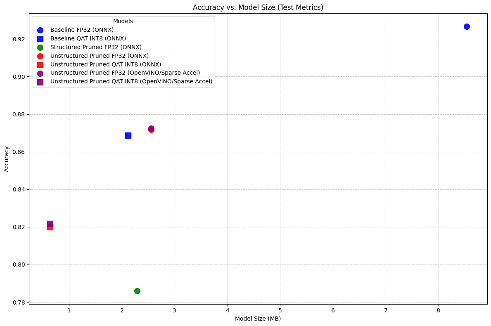
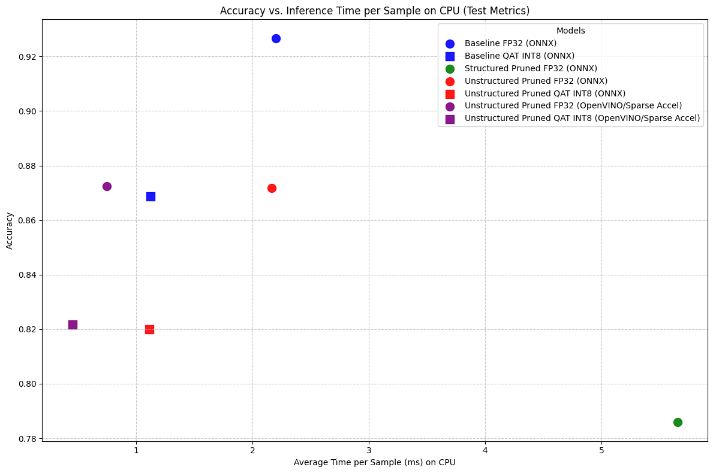

# nnopt
A demo for optimizing neural network inference throughoutput and storage to use on embedded device.




## Project Summary

The objective of this project is to showcase the optimization of neural network inference by reducing the output, storage and computational requirements for deployment on embedded devices. The project includes a demo that utilizes two pretrained models, specifically designed for image and audio processing tasks, and demonstrates how to optimize their performance for embedded systems.

### Image Processing Model
* Task: Image classification
* Model: MobileNetV2
* Dataset: CIFAR-10

### Optimization pipeline
The optimization pipeline includes the following steps:
1. **Pruning**: Remove low-importance weights, either unstructured (i.e., low-scored weights set to 0 to induce sparsity) 
or structured (i.e., low-importance channels or filters removed entirely to keep the model dense).
2. **Quantization**: Convert model weights and activations to INT8 using PTQ or QAT.
3. **Export**: Export the optimized model to ONNX and OpenVINO format for optimized deployment on CPU devices and TensorRT for NVIDIA GPUs.

## Installation

First, download the project source code from the repository. You can clone the repository using the following command:

```bash
git clone https://github.com/PaulBeuran/nnopt.git
```

It is recommended to install the project dependencies in a virtual environment.
This project uses `uv` for dependency management. If you don't have `uv` installed, please follow the installation instructions at [https://github.com/astral-sh/uv#installation](https://github.com/astral-sh/uv#installation).

Once `uv` is installed, you can create a virtual environment and synchronize it with the project's dependencies as follows:

```bash
# Automatically create the virtual environment and synchronize it with pyproject.toml
uv sync
```
Once done, you can run the notebooks in the `notebooks` directory to see the optimization process in action, or use the package `nnopt` in your own projects.

## Tested Environment

This project has been primarily tested on Linux distributions, with a specific focus on Windows Subsystem for Linux 2 (WSL2).
The development and testing were performed using the following hardware configuration:
*   **GPU**: NVIDIA GeForce RTX 4090
*   **CPU**: AMD Ryzen 9 7950X3D
